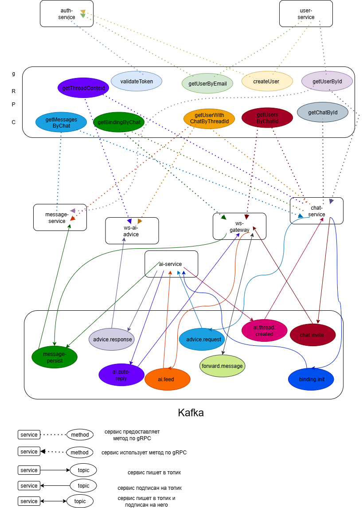

# AI Messenger

AI Messenger — микросервисное чат-приложение с AI-ответами на базе OpenAI GPT.  
Архитектура: Kafka + gRPC + WebSocket, реализована по чистой архитектуре.  
Каждое сообщение проходит пайплайн: от пользователя до AI и обратно — с логикой и retry на каждом этапе.

---

## 📐 Архитектура



---

## 🧩 Микросервисы

- `auth-service` — аутентификация, JWT
- `user-service` — создание/получение пользователя
- `chat-service` — биндинги, threadID, чат-контекст
- `message-service` — история сообщений, сохранение
- `ws-gateway` — WebSocket-приём и отправка сообщений
- `ai-service` — обработка binding/feed/advice через GPT
- `ws-ai-advice` — WebSocket-доставка AI-ответов

---

## 🔄 Поток данных

1. Пользователь отправляет сообщение через WebSocket (`ws-gateway`)
2. Сервис проверяет биндинги чата (gRPC в `chat-service`)
3. Если есть биндинги:
    - Сообщение пишется в Kafka `chat.message.persist`
    - Копия сообщения пишется в `chat.message.ai.feed`
4. `ai-service`:
    - Читает feed, отправляет в GPT
    - Пишет AI-ответ в `chat.message.ai-autoreply`
5. `ws-ai-advice`:
    - Читает `chat.message.ai-autoreply`
    - Получает контекст (gRPC в `chat-service`)
    - Пушит ответ в нужный WebSocket-рум

---

## ⚙️ Быстрый старт

```bash
make up            # Поднять всё через docker-compose
make migrate-up    # Применить миграции (migrate/migrate)
make proto         # Сгенерировать gRPC-код из .proto
make generate-mocks  # Сгенерировать моки из интерфейсов
make swagger-init     # Сгенерировать Swagger-доки из routes.go
```

---

## 📚 Примеры пайплайнов

### AI Feed (ws-gateway → Kafka → GPT → Kafka → ws-ai-advice)

```go
// отправка из ws-gateway
kafka.Produce(ctx, topicFeed, AiFeedPayload{
  SenderEmail: user.Email,
  Text:        msg,
  ThreadID:    threadID,
})

// обработка в ai-service
reply := gpt.SendMessageAndGetAutoreply(ctx, threadID, email, text)
stream.AutoReplyChan <- AiAutoReplyResult{ThreadID: threadID, Text: reply}

// отправка в Kafka
producer.Publish(ctx, threadID, replyBytes)

// ws-ai-advice читает и пушит
hub.SendToRoom(chatID, "message", map[string]interface{}{
  "text": reply,
  "fromAI": true,
})
```

---

## 🔌 Внешние зависимости

- Kafka (`confluentinc/cp-kafka:7.4.0`)
- Postgres 15
- migrate/migrate для миграций
- OpenAI API (через `infra/gpt`)
- Swagger (`swag init`)
- mockgen для моков

---

## ✅ Тесты

```bash
make test            # все unit-тесты
make test-integration  # интеграционные (с тегом integration)
make list-tests        # список всех *_test.go
```

---

## 📦 Общие утилиты

Переиспользуемые пакеты в `github.com/Vovarama1992/go-utils`:

- `grpcutil` — CircuitBreaker, Retry, Recover
- `httputil` — Throttle, Recover
- `pgutil` — pgx Pool + CircuitBreaker

---

## 🧪 Swagger и API

Swagger-описания живут в `internal/**/http/routes.go`, генерируются через:

```bash
make swagger-init
```

---

## 📁 Генерация моков

```bash
make generate-mocks         # из internal/**/ports
make generate-grpc-mocks    # из proto/**.proto
```

---

## 📎 Kafka Topics

```env
TOPIC_MESSAGE_PERSIST        = chat.message.persist
TOPIC_AI_FEED                = chat.message.ai.feed
TOPIC_AI_AUTOREPLY           = chat.message.ai-autoreply
TOPIC_AI_ADVICE_REQUEST      = chat.ai.advice-request
TOPIC_AI_ADVICE_RESPONSE     = chat.message.ai-advice-response
TOPIC_AI_BINDING_INIT        = chat.binding.init
TOPIC_CHAT_INVITE            = chat.invite.send
TOPIC_FORWARD_MESSAGE        = chat.message.forward
TOPIC_AI_THREAD_CREATED      = chat.binding.thread-created
```

---

## 🧠 GPT Prompt (для feed)

```go
"бро лови новое сообщение из диалога. емейл: %s, текст: %s"
```

---

## 🔗 Репозиторий

> Архитектура покрыта тестами, все зависимости замоканы через `make generate-mocks`. Проект поддерживает чистую архитектуру с каналами между этапами. Пайплайны можно наращивать под новые AI-сценарии.
